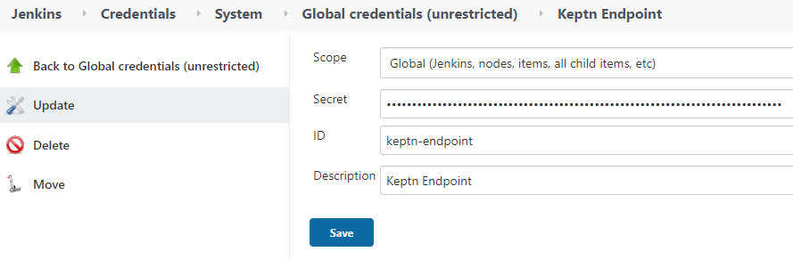

# Configure Keptn library for Jenkins
In this lab you'll learn how to configure the Keptn library for Jenkins.


## Step 1: Review Keptn library installation

Following the `everything as code` best practice, we have configure Jenkins to consume a Yaml file to grab all the configurations for our environment. One of those configurations is the keptn library for Jenkins that we will be using to simplify the communication between keptn api and Jenkins pipelines. 

1. In order to check the library configuration in the yaml file use the following command and search for `globalLibraries` in line 486.

```(bash)
(bastion) $ vi ./bootstrap/box/helm/jenkins-values-gen.yml 
```
You should see something like this 

    ```yaml
          globalLibraries:
            libraries:
            - name: "dynatrace"
              retriever:
                modernSCM:
                  scm:
                    git:
                      id: "6813bac3-894e-434d-9abb-bd41eeb72f88"
                      remote: "https://github.com/dynatrace-ace/dynatrace-jenkins-library.git"
                      traits:
                      - "gitBranchDiscovery"
            - defaultVersion: "master"
              name: "keptn-library"
              retriever:
                modernSCM:
                  scm:
                    git:
                      remote: "https://github.com/keptn-sandbox/keptn-jenkins-library.git"
                      traits:
                      - "gitBranchDiscovery"
    ```


2. You can also visualize the library in the Jenkins  UI by navigating to `Jenkins > Manage Jenkins > Configure System > Global Pipeline Libraries`.


## Step 2: Get Keptn credentials

Retrieve the Keptn credentials using the following

```bash
(bastion)$ export KEPTN_API_TOKEN=$(kubectl get secret keptn-api-token -n keptn -ojsonpath={.data.keptn-api-token} | base64 --decode)
(bastion)$ echo $KEPTN_API_TOKEN
(bastion)$ export KEPTN_BRIDGE=http://$(kubectl -n keptn get ingress keptn -ojsonpath='{.spec.rules[0].host}')/bridge
(bastion)$ echo $KEPTN_BRIDGE
(bastion)$ export KEPTN_ENDPOINT=http://$(kubectl -n keptn get ingress keptn -ojsonpath='{.spec.rules[0].host}')/api
(bastion)$ echo $KEPTN_ENDPOINT
```

## Step 3: Store Keptn credentials in Jenkins

 In this step we will add the Keptn credentials into Jenkins. 
 1. Inside Jenkins go into `Manage Jenkins > Manage credentials ` and select the first element with the house icon.


2. Then click `Global credentials > Add credentials`, use the dropdown Kind and select `secret text` and input the values from step 2. Repeat the process for each variable. For the ID field use the name from the images.




[Previous Step: Configure Keptn & Dynatrace integration](../02_Configure_Keptn_Dynatrace_Integration) :arrow_backward: :arrow_forward: [Next Step: Define Request Attributes](../04_Define_Request_Attributes)

:arrow_up_small: [Back to overview](../)
