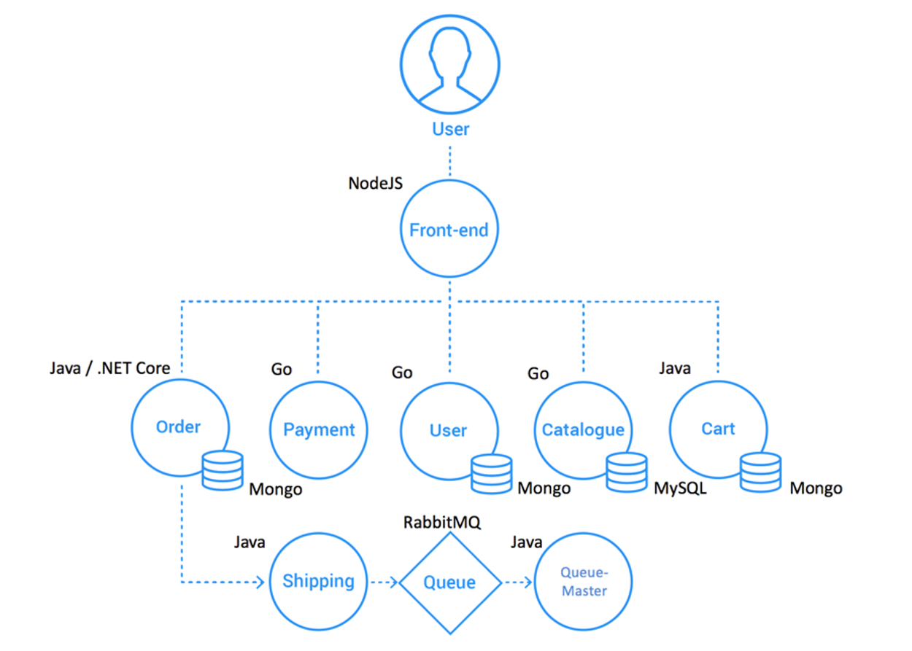

# Level Up your CD with Keptn Quality gates
SRE practices are taking over the enterprise application release landscape. Continuous automated release validation by evaluating Service Level Objectives is a key requirement for organizations to release software faster and more frequently without inhibiting quality. During this Hands-On Trainig, we will go over Keptn Quality Gates and how it can be used in conjunction with a CI/CD pipeline to detect regressions faster in order to achieve true shift-left.

## The application
We will be using a microservice called `carts` which is part of our `sockshop` application that emulates a marketplace for buying socks. The `carts` microservice is build using Java with a mongo-db database, and is responsible for the shopping cart process.

## Technology overview
In order to build this application we will be using the following technologies.
#### Jenkins
As our CI/CD orchestrator, Jenkins will build and deploy our application in the corresponding environments. It will be responsible for integrating our different technologies.
#### Gitea
Instead of using a public repository like github for hosting our pipeline definitions and required files to build our application, we will be using a self hosted source control using the gitea project. https://gitea.io

#### JMeter
JMeter will be use to automated performance testing against our different application endpoints.
#### Keptn
 Based on the SLO/SLI definitions we will provide Keptn will be responsible over the quality gate evaluation. 
#### Dynatrace
Monitoring the application during the test execution will allow us to measure the performance of our application.

#### Kubernetes on K3s
We will use Kubernetes running on K3s to create the base infraestructure to run our pipeline.

## Steps
These are the steps that we will take to create a working QG pipeline in Jenkins.
### Environment setup
0. [Environment overview](./00_Environment_Overview)
1. [Install Keptn](./01_Install_Keptn)
2. [Configure Monitoring with Keptn](../02_Configure_Keptn_Dynatrace_Integration)
3. [Configure Jenkins library](../03_Configure_Jenkins_Library)
### Test setup
4. [Define Request Attributes](../04_Define_Request_Attributes)
5. [Write a load test script](../05_Write_Load_Test_Script)
### Pipeline setup
6. [Define the pipeline](../06_Define_Pipeline)
### Run the pipeline
7. [Run the pipeline](../07_Run_Pipeline)
### Quality gate in action
8. [Analyze results in keptn bridge](../08_Analyze_Results_in_Keptn_Bridge)
9. [Find the root cause with Dynatrace](../09_Find_Root_Cause_Dynatrace)
### (Optional) Simplify pipeline setup
10. [Use dashboards as SLO providers](../10_SLO_Definition_Using_dashboards)

:arrow_forward: [Next Step: Check prerequisites](../00_Prerequisites)

